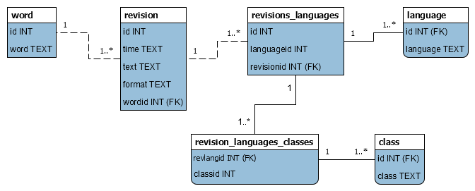

# WIKIWORDS

_wikitionary -> sqlite_

## About

This is a .js/[Node.js](https://nodejs.org) project that will take a wiktionary dump and parse/normalise it into an SQLite database.

## Why

I wanted a word list, that was; current, expansive, descriptive. I found it frustrating that this data was not anywhere else. Hacker lists, frequency lists, etc. are missing class information and are usually truncated/limited to n-percentile usage.

Wiktionary as a source is huge, and probably as good as any other authority on my native language (english), and maybe any other language. It is constantly updated, a living authority.

If Webster et. al. had a nice manner in which to grep their data I might've gone with one of them.

Now you can make your own lists.

## Caveats

> I am not a linguist.

This was only tested with english input, however there should be no reason other input languages would work. The source itself is not localised in any way. I've tried my best to ensure that it is locale agnostic.

This is relatively slow (takes almost 50m on my machine), mainly due to the xml stream that is being dealt with (2018-01 dump is 6GB). Memory should not be an issue -- however you can try adjusting the page_size parameter when calling (default: 250,000).

## Building

> Note: This project uses a package which depends on **[node-gyp](https://github.com/nodejs/node-gyp)**.

```
> yarn install
> yarn run build
```

## Usage

1. Go and [download](https://dumps.wikimedia.org/) *pages-meta-current.xml for your language. Note: the dumps contain words for all languages, just the page data is localised.

2. `> yarn run start word_classes input output [page_size]`

    * word_classes: a comma separated list of words used to classify the word (parts of speech) in the language of the input

        * example: *"noun,verb,adjective"*

    * input: wiktionary xml data
    * output: destination path for the SQLite file
    * page_size: _(optional)_ number of entries in a transaction

## Database



### Sample Queries

#### Word List

Create a list of words, that have been parsed with a class, including their class(es) for the language 'english'.

```
SELECT word.word, group_concat(class.class)
FROM word
JOIN revision ON revision.wordid = word.id
JOIN revisions_languages ON revisions_languages.revisionid = revision.id
JOIN language ON language.id = revisions_languages.languageid
JOIN revisions_languages_classes ON revisions_languages_classes.revlangid = revisions_languages.id
JOIN class ON class.id = revisions_languages_classes.classid
WHERE language.language = 'english'
GROUP BY word.word
ORDER BY word.word ASC, class.class ASC
```

## Known Limitations

* parsing of wikitext is _poor_
* there is no frequency data
* I have not verified all character data is stored properly.

## TODO

* list creation scripts
* command line interface
* convert to [ltx](https://github.com/xmppjs/ltx)
* explain reasons for using node-expat
* explain reasons for choosing better-sqlite3 over node-sqlite3
* tests

## Contributing

Feel free to open issues or submit a pull request.
